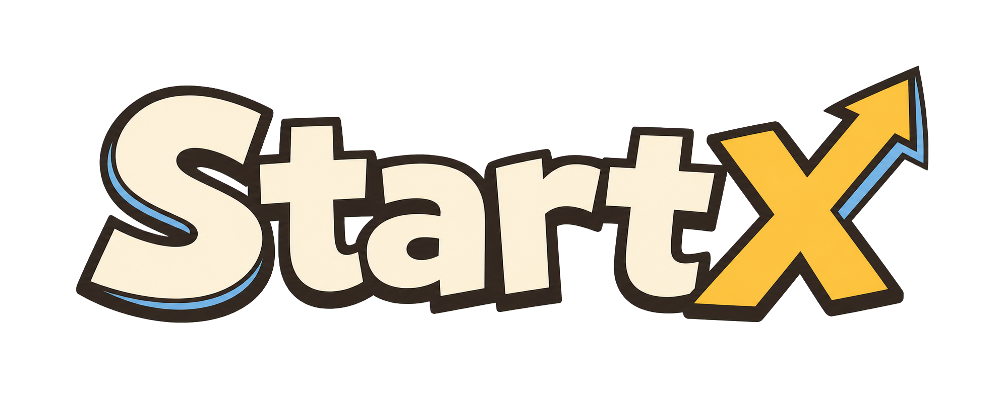

# StartX



StartX 是一款使用 **Godot 4.6** 开发的创业公司经营卡牌游戏原型。它借鉴 Stacklands 的堆叠交互，把员工、现金、客户线索、产品需求、设施、合同、竞争对手和研发方向都变成可拖动、可组合、可生产的卡牌。

玩家从车库里的小团队起步，通过安排员工、发现配方、购买卡包、建立供应链、处理竞争与经营压力，逐步提高现金、士气和公司估值。

> 当前状态：可游玩的开发中原型。核心卡牌操作、生产、研究、卡包、月度结算、商战和供应链等系统已经可以体验，内容规模与数值仍在持续调整。

## 核心体验

- **卡牌即公司资源**：员工、设施、市场资源和经营成果都直接存在于桌面上。
- **拖放完成工作**：把员工与输入卡叠在一起，自动匹配配方并开始生产。
- **自由经营桌面**：在办公室与市场区域之间整理卡组、平移视野和缩放棋盘。
- **研发与成长**：积累 RP，沿研发树解锁新想法、配方和发展方向。
- **现金循环**：从银行取出实体现金卡，把可出售卡牌拖回银行换取公司现金。
- **月度压力**：在倒计时结束前创造收入，并承担工资和持续经营成本。
- **自动供应链**：把生产中的牌堆连接到可接收产出的下游牌堆，减少重复搬运。
- **竞争与商战**：竞争对手会进入棋盘，与员工发生战斗并影响经营节奏。

## 已实现系统

### 卡牌与棋盘

- 方形 3D 卡牌、真实厚度、圆角、投影和悬浮反馈
- 卡牌拾取、拖动、堆叠、拆分、选择和出售
- 新卡首次出现标记与弹出动画
- 办公室 / 市场双区域棋盘
- 鼠标平移、缩放、视野边界和响应式窗口布局
- 卡牌信息提示、生产进度和底部状态栏

### 生产与配方

- 基于 JSON 的数据驱动配方
- 自动识别员工、资源、设施与消耗品
- 可消耗输入和可重复使用资源节点
- 生产进度、产出动画、配方首次发现
- 员工训练、资源加工、销售与合同等业务链路
- 生产牌堆到下游牌堆的供应链连接

### 经营与成长

- 公司现金、支出、士气、估值、月份与阶段
- 银行取现和卡牌出售
- 月末工资与经营结算
- 多阶段卡包、价格、解锁条件和权重卡池
- 研究点数、研发节点、前置条件和解锁内容
- 员工部门化与自动产出
- 商战、伤害反馈和竞争对手
- 音效、设置、制作人员名单和开始菜单

## 快速开始

### 环境要求

- Godot Engine **4.6**
- 支持 Vulkan 的桌面环境；兼容性取决于 Godot 4.6 的运行要求
- 推荐分辨率：`1920 x 1080`
- 最小窗口尺寸：`960 x 540`

### 使用 Godot 编辑器

1. 安装并启动 Godot 4.6。
2. 选择“导入”，打开 `game/project.godot`。
3. 等待 Godot 完成首次资源导入。
4. 点击“运行项目”或按 `F6/F5`。

项目入口场景为：

```text
game/scenes/StartMenu.tscn
```

### 使用命令行

在仓库根目录运行：

```bash
godot --path game --editor
```

直接启动游戏：

```bash
godot --path game
```

检查项目能否无窗口加载：

```bash
godot --headless --path game --editor --quit
```

## 基础玩法

1. 打开开局的车库创业包，获得第一批员工、设施和现金。
2. 把员工拖到可工作的资源或牌堆上。
3. 等待生产进度完成，收集线索、需求、商机、PRD 等产出。
4. 继续组合资源，把业务成果推进到合同、收入和现金。
5. 把可出售卡牌拖到银行换取公司现金。
6. 使用现金购买新卡包，扩充人员、设施和业务能力。
7. 安排员工进行研究，积累 RP 并解锁研发节点。
8. 关注月度倒计时、工资、士气和竞争对手，维持公司运转。

配方会在满足输入时自动开始。输入是否消耗由配方数据决定；线索池、客户需求等资源节点通常可重复使用。

## 操作方式

| 操作 | 功能 |
| --- | --- |
| 左键点击卡牌 | 拾取或放下卡牌 |
| 左键拖动卡牌 | 移动卡牌或牌堆 |
| 左键拖动空白棋盘 | 平移视野 |
| 鼠标滚轮 | 缩放棋盘 |
| 右键点击 | 取消拖动或放下当前携带卡牌 |
| 在生产牌堆上按住右键拖动 | 向可互动的下游牌堆建立供应链 |
| 点击供应链中点的删除按钮 | 解除供应链 |
| 点击银行 | 从公司现金中取出一张现金卡 |
| 把卡牌拖到银行 | 出售可出售的卡牌或牌堆 |
| 点击“研发” | 打开或关闭研发树 |
| 点击“配方书” | 查看已知配方 |
| `Esc` | 关闭开始菜单中的设置、开发者或制作人员面板 |

## 供应链

供应链用于把生产结果自动送往下一个可交互牌堆。

1. 找到一个正在生产或具有生产配方的牌堆。
2. 在该牌堆上按住鼠标右键。
3. 把连线拖到能够接收当前产出的下游牌堆。
4. 松开右键完成连接。

连接成功后，产出会沿箭头动画移动并叠入目标牌堆。每个生产源会保留一个下游目标；重新连接会更新目标。把鼠标移到连线上，可通过中点按钮删除连接。

## 项目结构

```text
.
├── game/
│   ├── project.godot             # Godot 项目配置
│   ├── scenes/
│   │   ├── StartMenu.tscn        # 开始菜单与设置
│   │   ├── Main.tscn             # 主游戏场景
│   │   └── TopHud.tscn           # 顶部经营 HUD
│   ├── scripts/
│   │   ├── Board.gd              # 棋盘、卡牌交互与主要玩法
│   │   ├── Card.gd               # 卡牌状态与 2D 绘制
│   │   ├── CardFaceBaker.gd      # 3D 卡面纹理生成
│   │   ├── CityBackground.gd     # 3D 城市场景与卡牌承载
│   │   ├── DataLoader.gd         # 数据表加载与查询
│   │   ├── GameState.gd          # 全局局内状态
│   │   ├── PackCard.gd           # 卡包表现与内容
│   │   ├── ResearchGraph.gd      # 研发树界面与交互
│   │   ├── Settings.gd           # 音量和显示设置
│   │   ├── StartMenu.gd          # 主菜单逻辑
│   │   └── sfx.gd                # 音效资源管理
│   ├── data/
│   │   ├── cards.json            # 卡牌定义
│   │   ├── recipes.json          # 配方定义
│   │   ├── packs.json            # 卡包定义
│   │   ├── research.json         # 研发节点
│   │   ├── idea_pools.json       # 各阶段想法池
│   │   ├── balance.json          # 全局数值
│   │   └── startx_data.xlsx      # 内容设计源表
│   ├── assets/                   # 图片、模型、UI、光标和音效
│   └── fonts/                    # 游戏字体
├── BOOSTER_PACKS.md              # 卡包与阶段设计
├── ORG_STRUCTURE.md              # 组织和部门系统设计
├── RECIPE_BOOK.md                # 完整配方设计
├── RESEARCH_TREE.md              # 研发树设计
└── Stacklands_like_Enterprise_Resource_Management_GDD_CN.pdf
```

## 关键代码

### `Board.gd`

主玩法控制器，负责棋盘绘制、输入、视野、卡牌生成与堆叠、配方生产、供应链、卡包、银行、研究、部门、战斗、月度结算和 HUD 协调。

### `Card.gd`

保存单张卡牌的运行时状态，并负责程序化卡面、标题、徽章、光泽、进度和命中区域。

### `DataLoader.gd`

加载 `game/data` 下的 JSON 数据，为卡牌、配方、卡包、研发和全局平衡提供统一查询入口。

### `GameState.gd`

保存现金、士气、月份、公司阶段、RP、估值、已解锁想法、已发现配方和随机状态等全局局内数据。

### `ResearchGraph.gd`

绘制研发树，处理节点前置条件、RP 消耗、解锁状态和面板交互。

### `CityBackground.gd`

管理 3D 城市场景、相机、灯光、卡牌根节点和屏幕尺寸适配。

## 数据驱动内容

多数内容无需修改主逻辑即可扩展：

- 新卡牌：编辑 `game/data/cards.json`
- 新配方：编辑 `game/data/recipes.json`
- 新卡包：编辑 `game/data/packs.json`
- 新研发节点：编辑 `game/data/research.json`
- 阶段想法池：编辑 `game/data/idea_pools.json`
- 月长与经营数值：编辑 `game/data/balance.json`

`game/data/startx_data.xlsx` 是内容设计源表，`game/data/数据表说明.md` 说明了表结构与维护方式。修改数据后，应重新启动项目并检查 Godot 输出中的加载错误、缺失 ID 和配方引用。

## 开发与验证

提交改动前建议至少运行：

```bash
godot --headless --path game --editor --quit
```

然后在编辑器中手动检查：

1. 开始菜单、设置和进入游戏流程。
2. 开局卡包是否正常打开。
3. 卡牌拖放、堆叠、生产和出售。
4. 研究面板与配方书。
5. 供应链建立、自动投递和删除。
6. 月末结算与竞争对手战斗。
7. `960 x 540`、`1280 x 720` 和 `1920 x 1080` 下的界面布局。

## 设计文档

- [配方全集](RECIPE_BOOK.md)
- [卡包与阶段](BOOSTER_PACKS.md)
- [研发路线图](RESEARCH_TREE.md)
- [组织与部门系统](ORG_STRUCTURE.md)
- [中文 GDD](Stacklands_like_Enterprise_Resource_Management_GDD_CN.pdf)

这些文档既包含当前原型内容，也包含尚未全部实现的长期设计。各文档中的实现状态标记应作为判断依据。

## 当前边界

- 这是玩法验证阶段的原型，不代表最终内容量、平衡或美术品质。
- 部分设计文档描述的是后续阶段，尚未完全进入当前可玩版本。
- 暂无正式存档兼容承诺；开发期间数据结构可能变化。
- 暂无自动化测试套件，主要依靠 Godot 项目加载校验和手动玩法回归。
- 当前主要面向桌面端鼠标操作。

## 许可证

项目代码按 [MIT License](LICENSE) 发布。第三方字体、音效、模型与其他素材可能适用各自的授权条款；再分发或商业使用前请分别确认素材来源和许可。
